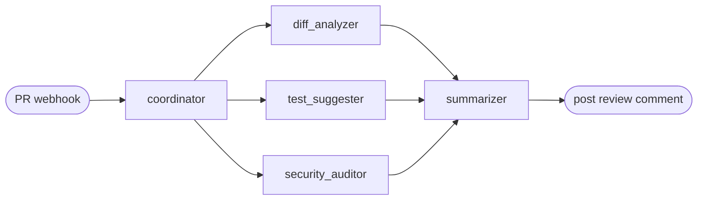

# 🤖 Autonomous PR Reviewer

**A team of specialized AI agents that automatically reviews GitHub Pull Requests
and posts a single, prioritized review comment — triggered by a webhook, traced,
costed, and guardrailed.**

When a PR is opened or updated, a [LangGraph](https://github.com/langchain-ai/langgraph)
agent graph fetches the diff and runs specialists **in parallel** — a diff
analyzer, a test suggester, and a security auditor — then a summarizer composes
their structured findings into one clean Markdown review and posts it back to the PR.

These aren't chatbots. They're **workers with tools**: they call the real GitHub
API, read real diffs, emit **structured** (schema-validated) findings, and the
graph decides the control flow.

> _📸 Screenshot / GIF of an auto-generated review comment goes here._

---

## ✨ Highlights

- **Multi-agent graph** with a coordinator, parallel specialists, and a fan-in summarizer (LangGraph `StateGraph`).
- **Conditional routing** — the coordinator decides which agents run (skips security/tests on docs-only PRs).
- **Structured output everywhere** — no regex-parsing of LLM free text; every finding is a validated Pydantic model.
- **Per-agent failure isolation** — one agent failing never crashes the review; the summarizer degrades gracefully.
- **Guardrails** — secret redaction, prompt-injection neutralization, size caps (input) + redaction, prompt-leak stripping, length caps (output).
- **Observability** — Langfuse tracing (one trace per PR, a span per agent) + per-PR token/USD cost + a `/stats` endpoint.
- **Eval harness** — 12 fixture PRs + golden set scoring **security recall**, **false-positive rate**, and **LLM-as-judge faithfulness**.

See **[architecture.md](architecture.md)** for the graph diagram, state flow, and failure handling.

---

## 🏗️ Architecture (at a glance)



- **Coordinator** — fetches PR data, sets `agents_to_run`, drives conditional fan-out.
- **Diff Analyzer** — summarizes intent + flags risky changes per file.
- **Test Suggester** — proposes missing test cases (edge/error paths).
- **Security Auditor** — flags injection, hardcoded secrets, unsafe deserialization, path traversal, SSRF, weak crypto, missing validation.
- **Summarizer** — writes one prioritized Markdown review (security → correctness → tests).

---

## 🚀 Quickstart

### 1. Prerequisites

- **Python 3.12** (LangGraph/LangChain break on very new Pythons — use 3.12).
- Redis (for dedup) — or just use Docker Compose below.
- A **GitHub token** (`repo` scope, or fine-grained: Pull requests R/W + Contents R).
- An **Anthropic API key**.

### 2. Configure

```bash
cp .env.example .env
# then fill in GITHUB_TOKEN, GITHUB_WEBHOOK_SECRET, LLM_API_KEY (Anthropic), etc.
```

### 3. Run locally

```bash
# This repo was developed with `uv` (fast, self-contained Python):
uv venv --python 3.12 .venv
uv pip install --python .venv/bin/python -r requirements.txt

# ...or plain pip:
python3.12 -m venv .venv && source .venv/bin/activate && pip install -r requirements.txt

uvicorn app.main:app --reload
curl localhost:8000/health   # {"status":"ok","version":"0.1.0"}
curl localhost:8000/stats    # aggregate review metrics
```

### 4. Run with Docker (app + Redis)

```bash
docker compose up --build
# app on http://localhost:8000, redis on :6379
```

### 5. Run the tests

```bash
pytest -q      # unit + integration; fully mocked, no API key needed
```

### 6. Run the evals

```bash
python evals/run_evals.py    # needs a real LLM_API_KEY for real numbers
```

---

## 🔗 Wiring the GitHub webhook

Point a repo webhook at `https://<your-host>/webhook/github`:

- **Payload URL**: `https://<your-host>/webhook/github`
- **Content type**: `application/json`
- **Secret**: the same value as `GITHUB_WEBHOOK_SECRET`
- **Events**: *Pull requests* (the app acts on `opened` and `synchronize`)

Invalid signatures are rejected with **401**. The same head SHA is reviewed once
(Redis dedup). The endpoint returns `200` immediately and runs the review in the
background so GitHub never times out.

---

## 📊 Eval Scorecard

Run `python evals/run_evals.py` to score the agents against 12 curated fixture
PRs (8 with planted vulnerabilities, 3 clean, 1 with a correctness bug).

**Latest run** (`llama-3.3-70b-versatile` via Groq):

```
  Security recall:        7/8   (87.5%)    # SQLi, secret, cmd-inj, deser, path-traversal, SSRF, missing-validation
  False-positive rate:    0 findings on 4 clean fixtures  (0.0%)
  Diff-analysis (judge):  2.5/5 (50.0% faithful)
```

> The provider is switchable via `LLM_PROVIDER` (`groq` for free dev, `anthropic`
> for best quality). Recall/false-positive numbers above are strong even on an
> open model; the judge score is model-dependent (running the LLM-as-judge on a
> stronger model raises it).

The scoring math (recall, false positives, aggregation) is unit-tested
independently of the LLM in [`tests/test_evals.py`](tests/test_evals.py).

---

## 🧰 Tech stack & design decisions

| Choice | Why |
|---|---|
| **LangGraph** | Explicit control flow (conditional edges, parallel fan-out, reducers) — not an opaque agent loop. The graph decides which agents run. |
| **Structured output** (`with_structured_output`) | Findings are validated Pydantic models, not parsed free text. Robust and testable. |
| **Reducers on shared state** | Parallel agents write `errors`/`token_usage` concurrently; reducers merge instead of clobbering. |
| **Per-agent try/except** | One agent (or its LLM call) failing must not crash the review — it degrades with a note. |
| **Guardrails as a layer** | Secrets never reach the model or the comment; injected instructions are neutralized to data; oversized diffs are capped. |
| **Langfuse + `/stats`** | Every run is traced and costed — you can answer "how much does a review cost?" with a real number. |
| **Eval harness** | Proves quality with numbers (recall / FP / faithfulness), not vibes. |
| **httpx GitHub client** | Full control over rate limits, retries, and typed errors. |
| **Anthropic Claude** (`claude-sonnet-5` default) | Opus-tier coding quality at lower cost for per-PR runs; switch to `claude-opus-4-8` via `LLM_MODEL`. Adaptive-thinking models, so no sampling params are sent. |

### Project layout

```
app/
  main.py            FastAPI: /health, /stats, /webhook/github
  config.py          Pydantic settings (fail-loud on missing env)
  github/            client.py (async, retries, typed errors) + webhook.py (HMAC)
  agents/            state.py, graph.py, coordinator + 3 specialists + summarizer
  tools/             GitHub tools as LangChain @tools ({ok,data,error})
  guardrails/        input_guard.py, output_guard.py
  observability/     tracing.py (Langfuse), cost.py, stats.py
  review.py          fetch PR → run graph → post → trace/cost/stats
evals/               fixtures/, golden_set.json, scoring.py, judge.py, run_evals.py
tests/               github client, graph, agents, guardrails, webhook, evals, ...
```

---

## 🧪 What "good" looks like here

- Structured output everywhere — no regex-parsing of LLM text.
- One agent failing never crashes the review.
- Conditional graph edges — the coordinator genuinely decides which agents run.
- Real tool calls to GitHub, not mocked-in-prod.
- Traced + costed — every run visible with a `$` number.
- Guardrails tested — including the prompt-injection test.
- Evals with numbers — recall, false-positive rate, judge score.

---

## 📝 License

MIT (or your choice).
