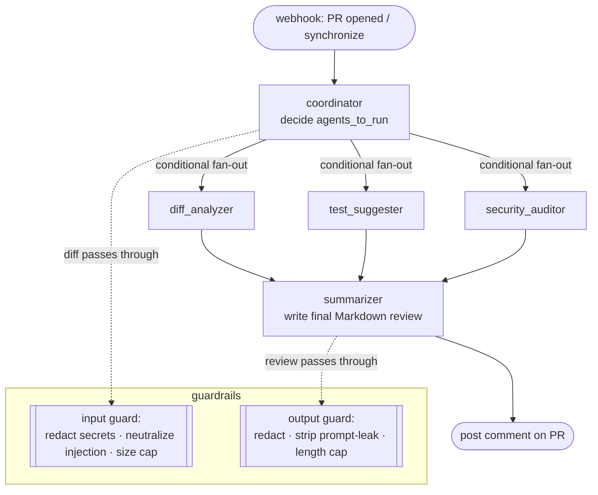

# Architecture

## The agent graph

The review is orchestrated as a [LangGraph](https://github.com/langchain-ai/langgraph)
`StateGraph`. A **coordinator** decides which specialists to run; the selected
specialists run **in parallel** and write structured findings into shared state;
a **summarizer** joins their output into one review comment.



## State flow

All nodes share a single `PRReviewState` (a `TypedDict`). The coordinator
populates inputs and sets `agents_to_run`; each specialist writes to its **own**
field (`diff_findings` / `test_suggestions` / `security_findings`), so parallel
writes never collide. Two fields *are* written by multiple nodes in the same
superstep — `errors` and `token_usage` — and are annotated with **reducers**
(`operator.add` and a dict-merge) so concurrent updates merge instead of
clobbering.

```
PRReviewState:
  inputs:   owner, repo, pr_number, pr_title, pr_body, diff, changed_files
  working:  diff_findings, test_suggestions, security_findings   # one writer each
  control:  agents_to_run, errors[reducer]
  output:   final_review
  observ.:  trace_id, token_usage[reducer]                       # {agent: {prompt, completion, total, cost_usd}}
```

## Conditional edges

The coordinator genuinely decides control flow. `decide_agents()` inspects the
changed files:

- **diff analyzer** always runs (even docs deserve a summary),
- **test suggester** and **security auditor** run only when code files changed.

A LangGraph *conditional edge* (`route_specialists`) then fans out to **only**
the chosen specialists. A docs-only PR routes to the diff analyzer alone and the
summarizer still joins cleanly — the fan-in waits only for branches that
actually ran.

## Failure handling

One agent failing must never crash the review:

- Each specialist node is wrapped in `try/except`; on failure it appends to
  `state["errors"]` and records zeroed usage, then the graph continues.
- The summarizer notes any degraded sections. If the summarizer's own LLM call
  fails, it returns a **deterministic fallback** review assembled from whatever
  structured findings exist — so a review is always produced and posted.
- The GitHub client retries 5xx/network errors with exponential backoff and
  raises a typed `GitHubError`; tools wrap failures in an `{ok, data, error}`
  envelope so agents can reason about them.

## Guardrails (defense in depth)

- **Input guard** runs on the diff before any LLM sees it: regex-redacts
  secrets, neutralizes prompt-injection spans (wrapped as `[FLAGGED-…]` data),
  and caps size via per-file truncation.
- **Output guard** runs on the final comment: redacts secrets, strips lines that
  echo the system prompt, caps length.
- **Schema enforcement**: every specialist uses `with_structured_output` and
  `call_structured` retries once on malformed output before failing that agent.

## Request path

```
GitHub ──POST /webhook/github──▶ verify HMAC (401 if bad)
                                  │
                                  ├─ parse (opened/synchronize only)
                                  ├─ Redis dedup on head SHA (fail-open)
                                  └─ BackgroundTask ▶ run_review
                                        fetch PR ▶ graph.ainvoke (Langfuse trace)
                                        ▶ post comment ▶ record stats + cost log
```
